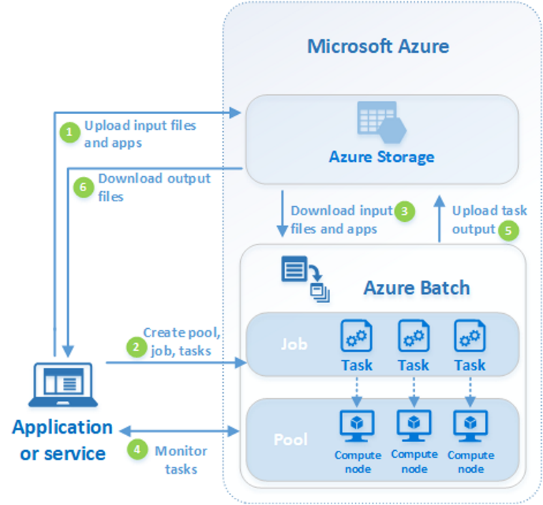

# Azure Batch runs for Models 

Models are processes that take input and process via files and environment variables and run an exectuable producing output

(input(s) --> EXE --> output(s))



Azure Batch runs for a model, i.e., a executable that runs independently based on a set of input files and environment
variables and produces a set of output files.

This module is currently tested with "Windows" based exes but shoud be easily adapatable to "Linux"

# Setup 

Setup can be done via az commands. Here we setup a batch account with associated storage

## Login with your Azure credentials

```az login ```

## Create a resource group in the desired location

See the Azure docs for details. To use the commands below, enter your values (replacing the angle brackets and values)

```az group create --name <resource_group_name> --location <location_name>```

```az storage account create --resource-group <resource_group_name> --name <storage_account_name> --location <location_name> --sku Standard_LRS```

```az batch account create --name <batch_account_name> --storage-account <storage_account_name> --resource-group <resource_group_name> --location <location_name>```

You can also create the batch account and associated account as explained here https://docs.microsoft.com/en-us/azure/batch/batch-account-create-portal

## Applications

Applications are binary executable packages. These are uploaded as application packages with a version number. A pool can be specified
so that these application packages are pre-downloaded to the nodes of the pool before a job/tasks are run on it.
See details here 
* https://docs.microsoft.com/en-us/azure/batch/nodes-and-pools#application-packages
* https://docs.microsoft.com/en-us/azure/batch/batch-application-packages

## Config file

Update the Batch and Storage account credential strings below with the values
unique to your accounts. These are used when constructing connection strings
for the Batch and Storage client objects. You can find these as explained here https://docs.microsoft.com/en-us/azure/batch/batch-account-create-portal#view-batch-account-properties

Create a file with the following structure and replace the <> brackets and the text within them with the appropriate values. See [this code](dmsbatch/commands.py#L17) for more details

```
[DEFAULT]
_BATCH_ACCOUNT_NAME = <batch_account_name>
_BATCH_ACCOUNT_KEY = <batch_account_key>
_BATCH_ACCOUNT_URL = https://<batch_account_name>.<location>.batch.azure.com
_STORAGE_ACCOUNT_NAME = <storage_account_name>
_STORAGE_ACCOUNT_KEY = <storage_account_key>
```

## VM sizes available

This is needed later when deciding what machine sizes to use

```az batch location list-skus --location <location_name> --output table```

You can also browse [the availability by region](https://azure.microsoft.com/en-us/global-infrastructure/services/?regions=us-west-2&products=virtual-machines) as not all VMs are available in every region

This [page is to guide selection of VMs](https://azure.microsoft.com/en-us/pricing/vm-selector/) by different attributes

## OS Images available

```
set AZ_BATCH_ACCOUNT=<batch_account_name>
set AZ_BATCH_ACCESS_KEY=<batch_account_key>
set AZ_BATCH_ENDPOINT=<batch_account_url>
az batch pool supported-images list --output table
```
A [sample output](notebooks/osimage.list.txt) is included for quick reference 

# Tools
Azure allows you to do most things via the command line interface (cli) or the web console. However I have found the following
desktop apps useful for working with these services.

[Batch Explorer](https://azure.github.io/BatchExplorer/) is a desktop tool for managing batch jobs, pools and application packages

[Storage Explorer](https://azure.microsoft.com/en-us/features/storage-explorer/) is a desktop tool for working with storage containers

# Classes

There are two classes in batch.commands

* [*AzureBlob*](dmsbatch/commands.py#L898) to work with uploading/downloading to blobs

* [*AzureBatch*](dmsbatch/commands.py#L120) to work with pools, jobs and tasks. Depends upon [*AzureBlob*](dmsbatch/commands.py#L898) but not other way around

Management of batch resources such as creation of batch account, storage account, etc is a low repeat activity and can be managed via the az command line options or web console.

## Model

Model is considered to be something that :-
 - needs application packages, versions and the location of the binary directory (i.e. ApplicationPackage[])
 - can have one or more input file(s), common ones or unique ones. 
  * These need to be uploaded to storage as blobs and then referenced
 - needs environment variables
  * These are specified as name, value pairs (i.e. python dicts)
 - can have output file(s), which are uploaded to the associated storage via directives to the batch service

 If the input and output files are specified by the [create...spec](dmsbatch/commands.py#L265) methods on [*AzureBatch*](dmsbatch/commands.py#L120) then those are directives to the  batch service to download the inputs and upload the outputs without writing specfic code.


## Model run

 Model run is a particular execution that is submitted to the batch service as a *task* 
 Each run :-  
  - needs a unique task name 
  - will have an output unique to it
  - could have a set of unique input files
  - could have environment settings unique to each run

# Sample Notebooks

See the [sample notebooks](./notebooks/) for examples
The samples explain step by step and can be used as a template for writing your own batch run

The [simplest example](./notebooks/sample_submit_dsm2_hydro_version.ipynb) is a run of dsm2 hydro outputting its version

A [slightly more involved example](./notebooks/sample_submit_dsm2_historical.ipynb) is a run of dsm2 hydro that uploads the input files as a zip and then uploads the output directory next to the uploaded input files at the end of the run

## Parameterized runs

 Many times the model runs are closely related to each other and only a few parameters are varied. These are
 submitted as a *task* to the batch service and perhaps reuse the same *pool* 
 The batch submission script samples the paramter space and submits the *task*.

 The best way to submit these *tasks* is to vary the environment variables and have the model use those 
 environment variables to change the parameter values. A less efficient but equally effective way would be to 
 express the change in parameter input as a changed input file that can be overlaid on top of the other inputs

 In each case, the model run is expressed as a *task*

 An [example of this](./notebooks/sample_submit_ptm_batch.ipynb) demos it for PTM batch runs that vary based on environment variables. It also shows an example where a large file needs to be uploaded and shared with all the running tasks

## Beopest runs

 PEST (Parameterized ESTimation) is a software package for non-linear optimization. Beopest is a master/slave model 
 to implement a parallel version of estimation runs. Each run is a separate process that needs to run on its own set of
 a model run. The difference between the "Parameterized" runs and this is that the orchestration of the parameters is 
 done by beopest.

 First a beopest master is submitted to the batch service. Then that tasks stdout.txt is polled and the first line is 
 assumed to have the hostname which is then captured. This hostname is then passed as an environment variable to start
 multiple slaves as batch runs.  beopest master should then be able to register these slave tasks as they come in and 
 submit runs to them through its own mechanism (MPI). 
 
 This [notebook](./notebooks/sample_submit_beopest.ipynb) shows an implementation of the scheme above.

 ## MPI runs

 SCHISM is a multi dimensional model that uses multiple cores and multiple hosts for computation. These are networked
 computers that form "clusters" using MPI for communication. 
 This [notebook](./notebooks/sample_submit_hello_schism.ipynb) demos the setup. Some of the 
 differences are :-
 * Use multi-instance tasks using AZ_BATCH_HOST_LIST to get list of networked hosts available
 * Use H series VMs capable of leveraging Infiniband (though other VM/os combinations may work)
 * Use Linux OS with *HPC images with appropriate device drivers
 
# References

[Python SDK Setup](https://docs.microsoft.com/en-us/azure/developer/python/azure-sdk-overview)

[BlobStorage Python Example](https://github.com/Azure/azure-sdk-for-python/tree/main/sdk/storage/azure-storage-blob)

[Azure Batch Python API](https://docs.microsoft.com/en-us/python/api/overview/azure/batch?view=azure-python)

[Azure Batch Python Samples](https://github.com/Azure-Samples/azure-batch-samples/tree/master/Python)

[Azure Batch Shipyard](https://github.com/Azure/batch-shipyard)

## MPI specific

[Azure Batch MPI](https://docs.microsoft.com/en-us/azure/batch/batch-mpi)

[Cluster configuration options](https://docs.microsoft.com/en-us/azure/virtual-machines/sizes-hpc#cluster-configuration-options)

### Intel MPI
[Azure settings for Intel MPI](https://docs.microsoft.com/en-us/azure/virtual-machines/workloads/hpc/setup-mpi#intel-mpi)

[Intel MPI Pre-requisites](https://www.intel.com/content/www/us/en/develop/documentation/mpi-developer-guide-linux/top/installation-and-prerequisites/prerequisite-steps.html)
